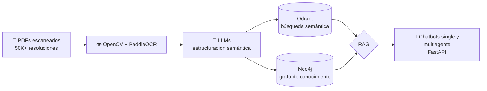

<div align="center">

# Hola, soy Paul 👋

<a href="https://github.com/HermanMoreno98">
  <picture>
    <source media="(prefers-color-scheme: dark)" srcset="https://readme-typing-svg.demolab.com?font=JetBrains+Mono&weight=600&size=22&pause=1200&color=58A6FF&center=true&vCenter=true&width=640&lines=Data+Scientist+%40+BCP;Agentic+AI+%C2%B7+LLM+%C2%B7+RAG+%C2%B7+NLP;Document+Intelligence%3A+OCR+%2B+LLMs;Qdrant+%2B+Neo4j+%C2%B7+FastAPI+%C2%B7+Docker">
    
  </picture>
</a>

**Construyo sistemas de IA que pasan del notebook a producción.**<br>
Data Scientist en **BCP** · MSc. Data Science (UCSP) · Lima, Perú 🇵🇪

[](https://www.linkedin.com/in/paul-moreno-alvarado/)
[](mailto:hermanmoreno020598@gmail.com)

</div>

---

## ⚡ En resumen

```yaml
rol:          Data Scientist · AI Engineer
foco:         IA agéntica, LLMs, RAG, NLP, Computer Vision
ahora:        Document Intelligence e IA cognitiva para crédito en BCP
formación:    Economista → MSc. Data Science
idiomas:      Español, Inglés
```

<table>
  <tr>
    <td align="center" width="50%"><h3>5+</h3><sub>años programando soluciones de datos e IA</sub></td>
    <td align="center" width="50%"><h3>2</h3><sub>publicaciones técnicas y académicas</sub></td>
  </tr>
</table>

---

## 🔭 En qué estoy trabajando

En **Banco de Crédito BCP** construyo soluciones de IA cognitiva para el negocio de Crédito:

- **Document Intelligence** para evidencia financiera: extracción con OCR, clasificación, normalización y validación con reglas de negocio sobre documentos de ingresos y deudas.
- **Arquitectura de IA en producción** que combina orquestación conversacional, lógica determinista y soporte a decisiones de crédito basado en políticas.

---

## 🏗️ Caso destacado: RAG híbrido en el JNE

Sistema de extracción semántica y consulta sobre resoluciones electorales escaneadas del **Jurado Nacional de Elecciones**:



`Python` `OpenCV` `PaddleOCR` `LangChain` `Qdrant` `Neo4j` `FastAPI` `Docker`

---

## 🚀 Proyectos

| | Proyecto | Qué resuelve | Stack |
|:-:|:---|:---|:---|
| 🤖 | [**Agent SUNASS**](https://github.com/HermanMoreno98/agent_project_sunass) | Agente IA multiherramienta para análisis regulatorio del sector agua | LangChain · RAG |
| 💬 | [**Bot Financiero**](https://github.com/HermanMoreno98/bot-financiero) | Chatbot con LLM para análisis financiero y alertas | Flask · LangChain |
| 📈 | [**Credit Scoring Pipeline**](https://github.com/HermanMoreno98/credit-scoring-pipeline) | Pipeline modular de scoring crediticio con monitoreo de *data drift* | XGBoost · MLflow |
| 🌊 | [**Proyecto Big Data**](https://github.com/HermanMoreno98/proyecto-bigdata) | Streaming end-to-end: Kafka → Flink → Spark → AWS S3/EMR | Kafka · PySpark · AWS |
| 🏆 | [**Datathon PCM 2024**](https://github.com/HermanMoreno98/datathon_pcm_2024) | Top solución en el datathon de la Presidencia del Consejo de Ministros | Python · ML |
| 🗺️ | [**GEODAP**](https://github.com/HermanMoreno98/GEODAP) | Análisis geoespacial de datos públicos de saneamiento | R · GIS |
| 🧱 | [**Flask MVC**](https://github.com/HermanMoreno98/Flask_MVC) | Aplicación web MVC con migraciones de base de datos | Flask · PostgreSQL |

---

## 🛠️ Stack

<p align="center">
  <picture>
    <source media="(prefers-color-scheme: light)" srcset="https://skillicons.dev/icons?i=py,r,pytorch,tensorflow,sklearn,opencv,fastapi,flask,docker,kubernetes,githubactions,gitlab,aws,postgres,mongodb,kafka&perline=8&theme=light">
    
  </picture>
</p>

<p align="center">
  
  
  
  
  
  
  
  
  
</p>

<details>
<summary><b>Ver stack completo por área</b></summary>
<br>

| Área | Herramientas |
|:---|:---|
| **Agentic AI, LLMs & RAG** | LangChain · LangGraph · CrewAI · Qdrant · Neo4j · OpenAI · Ollama |
| **Document AI & Computer Vision** | OpenCV · PaddleOCR · PyTorch · Hugging Face |
| **ML & Deep Learning** | Python · PyTorch · TensorFlow · scikit-learn |
| **MLOps** | MLflow · Weights & Biases · Docker · Kubernetes · GitLab CI/CD · GitHub Actions |
| **Big Data** | Apache Spark · Kafka · Flink · Airflow · dbt · Dask |
| **Cloud & Databases** | AWS · PostgreSQL · Oracle · MongoDB · SQL Server |
| **Backend & Apps** | FastAPI · Flask · Streamlit · Shiny · Power Apps · Google Apps Script |
| **Visualización & GIS** | Power BI · Tableau · Looker Studio · QGIS · ArcGIS · Mapbox |
| **Lenguajes** | Python · R · SQL · JavaScript · Bash |

</details>

---

## 💼 Experiencia

<details open>
<summary><b>Banco de Crédito BCP — Data Scientist Cognitive</b> · Jun 2026 – Actualidad</summary>
<br>

- Levantamiento de requerimientos con stakeholders de Crédito para traducir necesidades de política, riesgo y operación en especificaciones técnicas.
- Pipelines de **Document Intelligence** para evidencia financiera: extracción con OCR, clasificación, normalización y validación con reglas de negocio.
- Arquitectura de **IA cognitiva en producción** que integra orquestación conversacional, lógica determinista y soporte a decisiones de crédito.

`Document Intelligence` `OCR` `LLMs` `IA conversacional`
</details>

<details>
<summary><b>Jurado Nacional de Elecciones — Artificial Intelligence Specialist</b> · Oct 2025 – Jun 2026</summary>
<br>

- Sistema de extracción y estructuración semántica de **resoluciones electorales escaneadas** combinando Computer Vision (OpenCV, PaddleOCR) y LLMs.
- Integración en base vectorial (**Qdrant**) y grafo de conocimiento (**Neo4j**) para análisis semántico y relacional de documentos legales.
- Backend en **FastAPI** con chatbots single y multiagente basados en RAG.

`Python` `OpenCV` `PaddleOCR` `Qdrant` `Neo4j` `FastAPI` `Docker`
</details>

<details>
<summary><b>SUNASS — Data Scientist</b> · Ene 2024 – Dic 2025</summary>
<br>

- Lideré un proyecto de **Computer Vision** para clasificar infraestructura de agua y saneamiento (tipo y estado) con imágenes de drones y de campo.
- Modelos no supervisados para optimizar la agrupación de prestadores según dinámicas territoriales.
- Modelos de ML sobre encuestas nacionales para generar insights estratégicos.
- Dashboards y aplicaciones web geoespaciales con Shiny; generación automatizada de reportes con Python.
- Software de recolección de datos en campo con Power Apps.

`PyTorch` `scikit-learn` `R` `Shiny` `Python` `Power Apps`
</details>

<details>
<summary><b>OEFA — Data Analyst</b> · Ago 2023 – Dic 2023</summary>
<br>

- Procesos ETL y automatización de reportes con Python y R.
- Automatizaciones y formularios web con Google Apps Script.
- Dashboards en Looker Studio para el seguimiento de procesos de supervisión ambiental.

`Python` `R` `Apps Script` `Looker Studio`
</details>

<details>
<summary><b>SUNASS — Asistente Económico</b> · Dic 2022 – Ago 2023</summary>
<br>

- Metodología **KNN espacial sobre +500K puntos geográficos**, publicada como nota técnica oficial.
- Procesamiento de bases de datos a gran escala con cómputo paralelo.
- Deep learning para predecir indicadores medidos en tiempo real.
- Análisis espacial con Python y QGIS; dashboards con Power BI, Mapbox y ArcGIS.

`Python` `Dask` `QGIS` `Power BI`
</details>

<details>
<summary><b>SUNASS — Economista Junior</b> · Sep 2020 – Dic 2022</summary>
<br>

- Dashboards sobre la situación de los servicios de agua y saneamiento en zonas urbanas y rurales.
- Procesamiento de encuestas del INEI (ENAHO, ENAPRES, ENDES).
- Control de calidad de la base de datos de prestadores de servicios.
</details>

<details>
<summary><b>SUNASS — Practicante de Investigación Económica</b> · Sep 2019 – Sep 2020</summary>
<br>

- Investigación sobre el impacto del acceso a agua y alcantarillado en la anemia infantil, publicada en la Revista UNALM.
</details>

---

## 📚 Publicaciones

- **Cóndor & Moreno (2023).** *Nearest Neighbor Distance Calculation Methodology Between Geographical Points and its Application in the Sanitation Sector.* Nota técnica, SUNASS. [📄 PDF](https://cdn.www.gob.pe/uploads/document/file/6265798/5512358-nt4-metodologia-de-calculo-de-distancia-por-vecino-mas-cercano-entre-puntos-geograficos-y-su-aplicacion-en-el-sector-saneamiento-002.pdf?v=1714427718)
- **Moreno et al. (2020).** *Impact of access to water and sewage services on anemia in children under 5 years of age in Peru.* Revista UNALM. [📄 Artículo](https://revistas.lamolina.edu.pe/index.php/ne/article/view/1940/2469)

---

## 🎓 Educación

| Título | Institución | Años |
|:---|:---|:-:|
| **MSc. Data Science** | Universidad Católica San Pablo | 2024–2026 |
| **Licenciatura en Economía** *(Décimo Superior)* | Universidad Nacional Federico Villarreal | 2015–2019 |

<details>
<summary><b>Certificaciones</b></summary>
<br>

- Summer Camp en Inteligencia Artificial — PUCP *(2025)*
- Especialización Advanced Data Science — Data Mining Consulting *(2024)*
- Diplomado en Big Data — Universidad Nacional de Ucayali *(2024)*
- Python for Data Science, AI & Development
- Data Science With Python
- Data Analysis with Python
- Business Intelligence With Power BI

</details>

---

<div align="center">

## 🤝 Conectemos

¿Te interesa conversar sobre **IA agéntica**, **RAG** o **Document Intelligence**?<br>
Escríbeme, siempre estoy abierto a intercambiar ideas.

[](https://www.linkedin.com/in/paul-moreno-alvarado/)
[](mailto:hermanmoreno020598@gmail.com)

</div>
